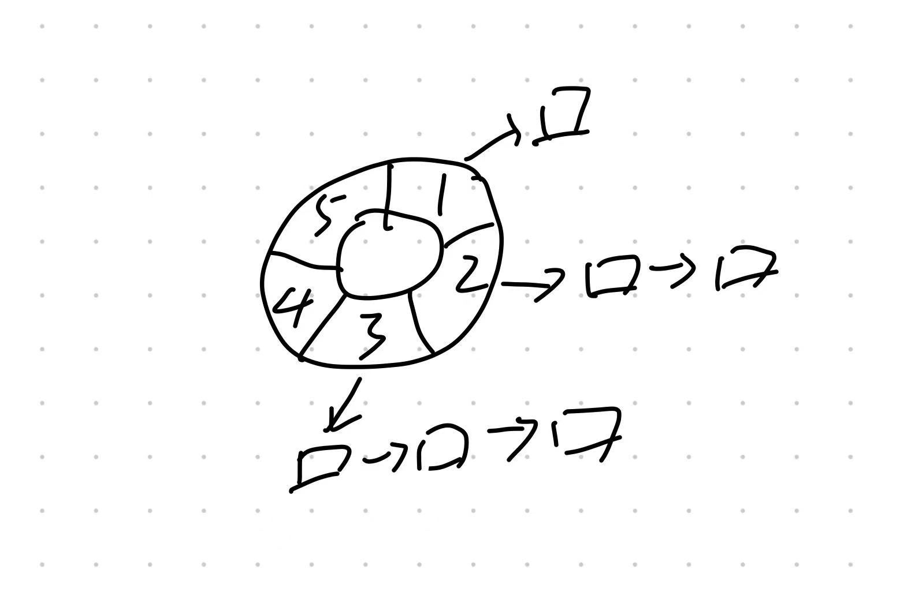

# TimeWheel
## 时间论资料
时间轮论文：[TimeWhell Paper](http://www.cs.columbia.edu/~nahum/w6998/papers/sosp87-timing-wheels.pdf)

时间轮BLog：[Data Structures for the Efficient Implementation of a Timer Facility](https://blog.acolyer.org/2015/11/23/hashed-and-hierarchical-timing-wheels/)

## 设计


## 启动
```java
public static void main(String[] args) {
    // 每一秒走一下，60秒为一圈
    TimeWheel timeWheel = new TimeWheel(1, 60);
    timeWheel.start();
    // 第5秒的任务
    timeWheel.add(5);
    // 第65秒的任务
    timeWheel.add(65);
}
```